<!--
  Profile README. The card below is regenerated every 6 hours by
  .github/workflows/telemetry.yml -- edit svg/templates/, not svg/*_mode.svg.
-->

<picture>
  <source media="(prefers-color-scheme: dark)"  srcset="./svg/dark_mode.svg">
  <source media="(prefers-color-scheme: light)" srcset="./svg/light_mode.svg">
  
</picture>

---

### About

MS student in Electrical and Computer Engineering at KAUST, in the Communication Theory Lab under Prof. Mohamed-Slim Alouini. BSc in Electrical Engineering from UET Lahore. Heading toward a PhD.

My work sits in two areas that I keep separate because they are separate:

**LEO satellite prognostics and health management.** I built a physics-based multi-fault telemetry corpus for small satellites using MATLAB/Simulink Monte Carlo simulation, covering ADCS and EPS fault modes, and a benchmark pipeline that runs supervised and unsupervised detectors against it. No public dataset of this kind existed, so the corpus itself is the contribution.

**Physical-layer characterization and IoT.** Protocol design and hardware experiments with Semtech LR2021 transceivers, plus LoRaWAN deployment work. Alongside that, modulation theory: GMSK, MSK, and the CPM family, worked from derivation through to simulation.

Earlier: deep reinforcement learning for reconfigurable intelligent surface optimization during a research internship in Taiwan, and embedded systems in industry.

### Instruments

MATLAB and Simulink (parsim, Parallel Computing Toolbox) · Python (PyTorch, scikit-learn, XGBoost, NumPy, pandas, cvxpy) · C for embedded targets · LaTeX · Git

Hardware: Semtech LR2021, LoRaWAN gateways, and the usual bring-up tooling.

### Currently

Finishing two papers from the satellite work, one on the simulator and dataset, one on the ML benchmark. Running FLRC hardware experiments. Applying to PhD positions.

### Reach me

[Email](mailto:you@example.com) · [Google Scholar](https://scholar.google.com) · [LinkedIn](https://linkedin.com)

The card above is generated by <a href="./telemetry.py"><code>telemetry.py</code></a> from the GitHub GraphQL and REST APIs. Line counts cover commits authored by me across owned repositories, cached per repository and recounted only after a push.
